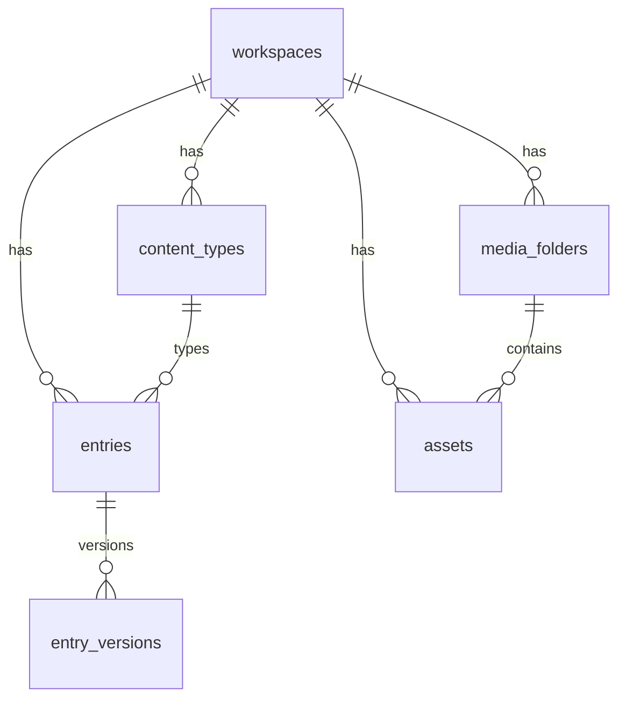

# CMS Data Model (Implemented)

How **workspaces**, **content types**, **entries**, and **media** relate in the current schema and API.

---

## Tenancy

Every CMS and media row includes `workspace_id`. API requests run queries inside `withWorkspaceContext()` so PostgreSQL RLS matches the active workspace.

```
User ──membership──► Workspace ──owns──► Content types, Entries, Assets, Folders
```

---

## Content types

**Table:** `content_types`

| Column | Description |
| ------ | ----------- |
| `name`, `slug` | Display name and unique slug per workspace |
| `schema` | JSONB `{ fields: [...] }` |

**Field types** (validated in `@repo/shared`):

`text`, `textarea`, `richText`, `number`, `boolean`, `date`, `slug`

**Rules:**

- At least one field per type  
- Field `id` values must be unique within the schema  
- Slug unique per workspace  

**Defaults** (shared templates in `packages/shared/src/default-content-types.ts`):

| Slug | Name | Typical fields |
| ---- | ---- | -------------- |
| `blog` | Blog Post | `title`, `body` (richText) |
| `page` | Page | `title`, `slug`, `body` (richText) |

Created automatically on `POST /workspaces`, or via bootstrap endpoint/UI.

---

## Entries

**Table:** `entries`

| Column | Description |
| ------ | ----------- |
| `content_type_id` | FK → `content_types` (ON DELETE restrict) |
| `slug` | Unique per workspace |
| `status` | `draft`, `published`, `archived` |
| `data` | JSONB matching content type schema |
| `published_at` | Set on publish |

**Versions:** `entry_versions` stores a snapshot on each publish (`version` increments).

**Validation:** `validateEntryData()` runs on create/update/publish against the content type schema.

---

## Media

**Tables:** `assets`, `media_folders`

### Assets

| Column | Description |
| ------ | ----------- |
| `storage_key` | MinIO path: `workspaces/{wsId}/assets/{assetId}/{filename}` |
| `status` | `pending` (presigned issued) → `ready` (complete) or `failed` |
| `folder_id` | Optional FK → `media_folders` |
| `mime_type`, `size_bytes`, `width`, `height` | Set on complete |

### Folders

| Column | Description |
| ------ | ----------- |
| `parent_id` | Optional nested folders |
| `name`, `slug` | Unique per `(workspace_id, parent_id, slug)` |

Delete folder blocked if it contains assets or child folders (`409`).

---

## Entity relationship (simplified)



---

## Storefront (not wired)

Published entries and asset URLs are **not** consumed by `apps/storefront` yet. Public rendering is a later phase.

---

## See also

- [DATABASE_STANDARDS.md](../architecture/DATABASE_STANDARDS.md)  
- [API_STANDARDS.md](../architecture/API_STANDARDS.md)  
- [DEVELOPMENT_STATUS.md](../product/DEVELOPMENT_STATUS.md)  
