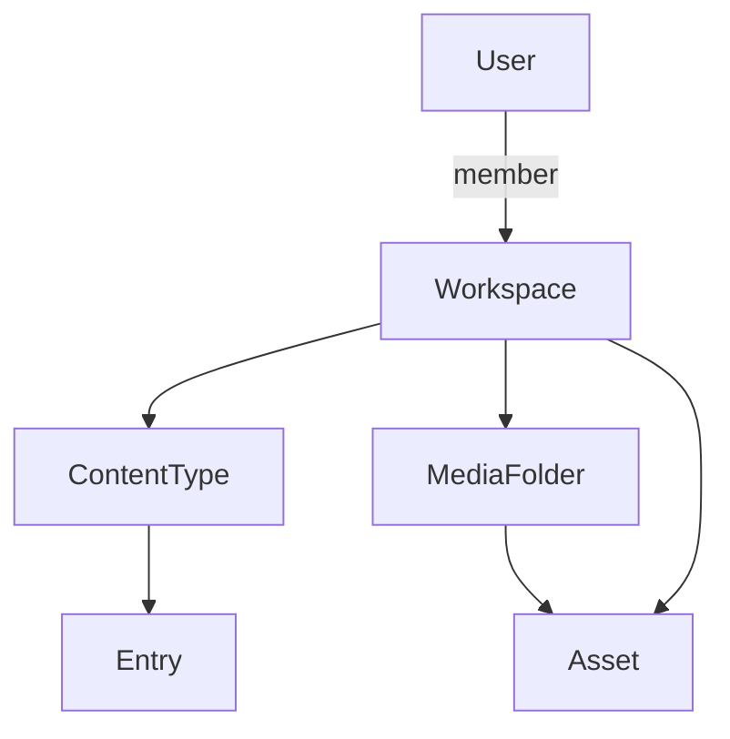

# Development Status

### Last updated: Phase 4 (Media MVP) complete

This document describes **what is implemented in the codebase today**, versus what remains planned in [IMPLEMENTATION_PLAN.md](./IMPLEMENTATION_PLAN.md).

**API version:** `0.4.0-phase4` · **Health `phase`:** `"4"`

---

## Phase completion summary

| Phase | Name | Status | Notes |
| ----- | ---- | ------ | ----- |
| 0 | Foundations | Done | Monorepo, Docker, health, shared packages |
| 1 | Core infrastructure | Done | DB client, Redis, BullMQ queue stub, env validation |
| 2 | Auth & workspaces | Done | Firebase, sessions, RBAC, invites, dashboard workspaces |
| 3 | CMS core | Done | Content types, entries, publish, versions, Tiptap |
| 3+ | CMS UX & workspace ops | Done | Edit/delete workspace, default content types, error UX |
| 4 | Media (MVP) | Done | Presigned uploads, assets, folders, Media tab |
| 4b | Media variants & picker | Planned | See [PHASE_4B_MEDIA_FUTURE.md](../engineering/PHASE_4B_MEDIA_FUTURE.md) |
| 5 | Dashboard shell | Planned | Sidebar, React Query, full design system |
| 6+ | Builder, storefront, commerce | Planned | Per implementation plan |

---

## Applications

| App | Port | Status |
| --- | ---- | ------ |
| `apps/web` | 3000 | Admin dashboard (auth, workspaces, CMS, media) |
| `apps/api` | 4000 | REST API + session cookies |
| `apps/storefront` | 3001 | **Stub only** — no CMS content rendering yet |

---

## Database (migrations)

| Migration | Tables / scope |
| --------- | ---------------- |
| `0000_initial` | Base platform tables |
| `0001_rls` | Row-level security policies |
| `0002_auth_workspace` | `users`, `workspaces`, `workspace_members`, `workspace_invites`, `workspace_settings` |
| `0003_cms_core` | `content_types`, `entries`, `entry_versions` |
| `0004_media` | `assets`, `media_folders` |

All tenant tables use RLS via `app.workspace_id` (set per request in API repositories).

**Seed data:** demo users, **Alpha Agency** workspace with `blog` content type and sample entries. Other workspaces do not get CMS seed data automatically.

---

## Implemented API surface

Base path: `/api/v1`. See [README.md](../../README.md) for the full endpoint list.

| Module | Prefix | Auth | Workspace context |
| ------ | ------ | ---- | ----------------- |
| Health | `/health`, `/ready` | Public | No |
| Auth | `/auth` | Session cookie | Optional active workspace |
| Workspaces | `/workspaces` | Yes | Per-route |
| Invites | `/invites` | Yes | Accept flow |
| Content types | `/content-types` | Yes | Required |
| Entries | `/entries` | Yes | Required |
| Media assets | `/assets` | Yes | Required |
| Media folders | `/media-folders` | Yes | Required |

**Workspace context:** session `activeWorkspaceId` or `X-Workspace-Id` header (same as CMS routes).

---

## Web dashboard routes

| Route | Feature |
| ----- | ------- |
| `/login` | Firebase email/password (+ optional dev quick-login) |
| `/invite/:token` | Accept workspace invite |
| `/dashboard` | List/create/edit/delete workspaces, switch active, invite members |
| `/content-types` | List types, bootstrap defaults, create custom types |
| `/entries` | List/filter entries |
| `/entries/new` | Create entry |
| `/entries/[id]` | Edit entry, publish |
| `/media` | Media library, upload, folders |

Shared layout: top bar, pill navigation, `max-w-6xl` content width. See [WEB_DASHBOARD_GUIDE.md](../engineering/WEB_DASHBOARD_GUIDE.md).

---

## Domain concepts (implemented)

| Concept | Purpose |
| ------- | ------- |
| **Workspace** | Tenant boundary; all CMS and media data scoped here |
| **Content type** | JSON schema of fields (`text`, `richText`, `slug`, etc.) |
| **Entry** | Content instance (`draft` / `published` / `archived`); publish creates `entry_versions` row |
| **Asset** | File in MinIO + metadata in Postgres (`pending` → `ready`) |
| **Media folder** | Optional grouping for assets |

**Default content types** (on workspace create): **Blog Post** (`blog`), **Page** (`page`). Existing workspaces: **Add default types** in UI or `POST /content-types/bootstrap-defaults`.

Details: [CMS_DATA_MODEL.md](../engineering/CMS_DATA_MODEL.md).

---

## RBAC (implemented permissions)

Defined in `packages/shared/src/rbac.ts` and enforced in API middleware.

| Area | Viewer | Editor | Admin | Owner |
| ---- | ------ | ------ | ----- | ----- |
| View CMS / media | Yes | Yes | Yes | Yes |
| Create/edit entries, publish | No | Yes | Yes | Yes |
| Content type CRUD | No | No | Yes | Yes |
| Media upload/delete | No | Yes | Yes | Yes |
| Media folders | No | Yes | Yes | Yes |
| Workspace edit | No | No | Yes | Yes |
| Workspace delete | No | No | No | Yes |
| Invite members | No | No | Yes | Yes |

Full matrix: [RBAC_PERMISSION_MATRIX.md](../architecture/RBAC_PERMISSION_MATRIX.md).

---

## Media upload flow (Phase 4)

1. Client `POST /assets/upload-requests` → pending row + presigned PUT URL  
2. Browser uploads directly to MinIO  
3. Client `POST /assets/:id/complete` → HEAD object, mark `ready`, optional image dimensions  

Setup: [MEDIA_LOCAL_SETUP.md](../engineering/MEDIA_LOCAL_SETUP.md).

---

## Validation & edge cases (implemented)

- Duplicate content-type field IDs rejected (`packages/shared/src/cms-schema.ts`)
- Content-type delete with entries → `409 Conflict`
- Workspace delete clears session if deleted workspace was active
- CMS pages: loading/error states, no active workspace banner
- Entry form: does not wipe data when changing type on new entry (dirty guard)

---

## Tests

| Package | Coverage |
| ------- | -------- |
| `@repo/shared` | CMS schema, RBAC, media validation, default content types |
| `apps/api` | Health, protected routes (auth, CMS, media), default content types service |

Run: `pnpm test` from repo root.

---

## Related documentation

| Document | Use when |
| -------- | -------- |
| [WEB_DASHBOARD_GUIDE.md](../engineering/WEB_DASHBOARD_GUIDE.md) | Using the admin UI day-to-day |
| [CMS_DATA_MODEL.md](../engineering/CMS_DATA_MODEL.md) | Understanding workspace → entry → asset relationships |
| [MEDIA_LOCAL_SETUP.md](../engineering/MEDIA_LOCAL_SETUP.md) | MinIO, CORS, uploads |
| [PHASE_4B_MEDIA_FUTURE.md](../engineering/PHASE_4B_MEDIA_FUTURE.md) | Next media work |
| [LOCAL_DEVELOPMENT_SETUP.md](../engineering/LOCAL_DEVELOPMENT_SETUP.md) | First-time dev environment |
| [IMPLEMENTATION_PLAN.md](./IMPLEMENTATION_PLAN.md) | Full roadmap |
